# ESP32-C6 CAN Telemetry Gateway

<p align="center">
  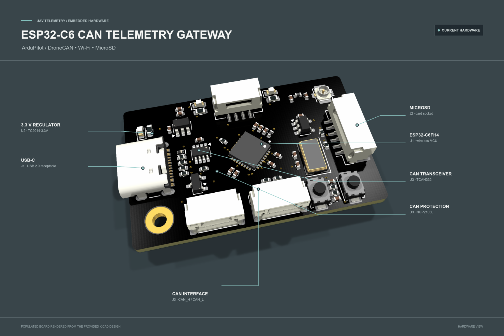
</p>

**A hardware design for an ESP32-C6 edge telemetry gateway for UAVs and robotics.** It is intended to sit alongside an ArduPilot flight controller and expose CAN / DroneCAN, Wi-Fi-capable MCU, USB-C, and MicroSD hardware interfaces. It is an auxiliary telemetry device, not a flight-controller replacement; gateway firmware and data services are not included.

> **Project status:** This repository contains KiCad hardware design files and derived documentation assets. It does not include gateway firmware, a telemetry decoder, a cloud service, or a dashboard. Network telemetry and local flight logging are planned system uses, not implemented or tested features.

## Key Features

- ESP32-C6FH4 MCU with integrated Wi-Fi radio and a U.FL RF connector path.
- TCAN332 3.3 V CAN transceiver with NUP2105L CAN-line protection.
- A fitted 120 ohm resistor across CANH and CANL.
- Four-position JST GH CAN connector with VBUS, CANH, CANL, and GND.
- MicroSD card socket and USB-C USB 2.0 interface.
- TC2014 3.3 V regulator, reset and boot switches, and auxiliary UART, I2C, and SPI headers.

These are hardware-design features only; no software operation is implied.

## Product Overview

The gateway is an edge device, not a flight controller replacement. The intended system puts the flight controller in charge of vehicle control and uses this board as a separate interface for telemetry experiments.

See [product.md](product.md) for a focused hardware description and [developement.md](developement.md) for the development workflow and validation record.

<p align="center">
  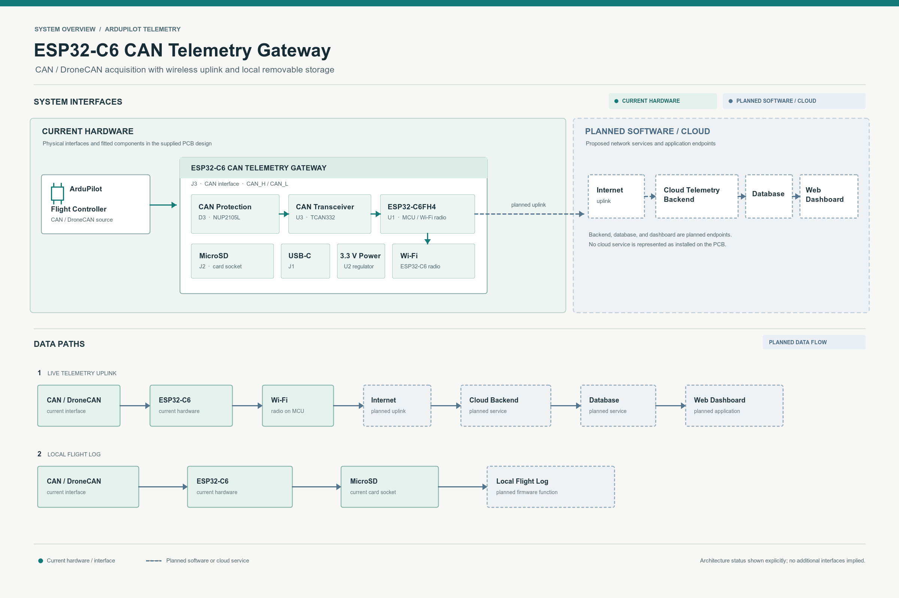
</p>

The architecture distinguishes **current hardware** from **planned software / cloud**. Internet access, backend ingestion, database storage, dashboard display, and MicroSD logging depend on firmware and services that are not present in this repository.

## PCB Design

The following views are rendered from the supplied KiCad PCB and its component models. The reverse-side view shows the actual board from below; it is intentionally not populated with imagined components.

<p align="center">
  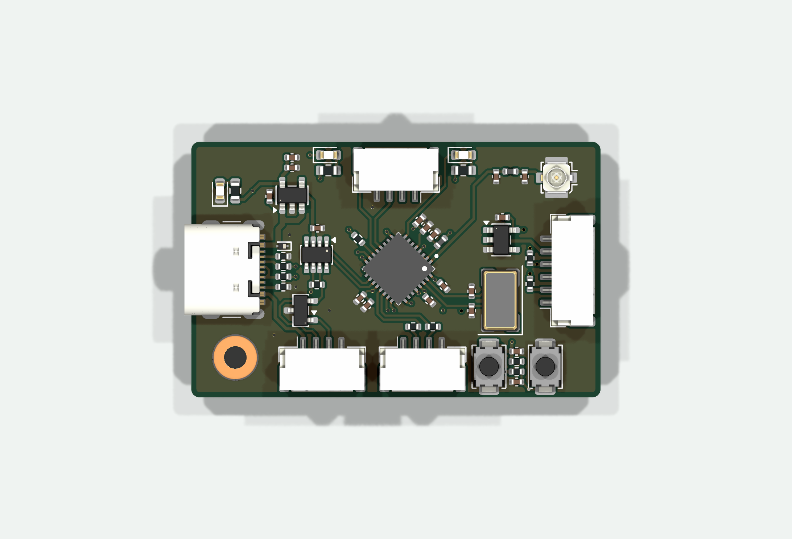
  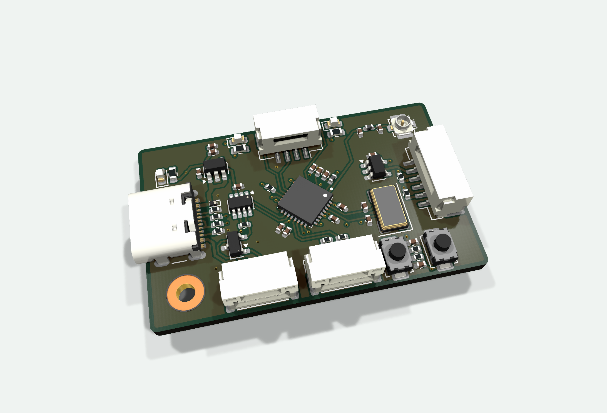
</p>

<p align="center">
  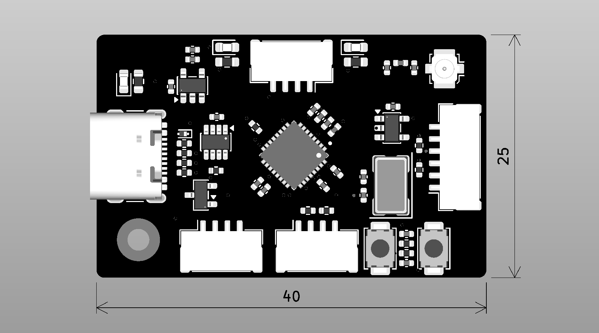
  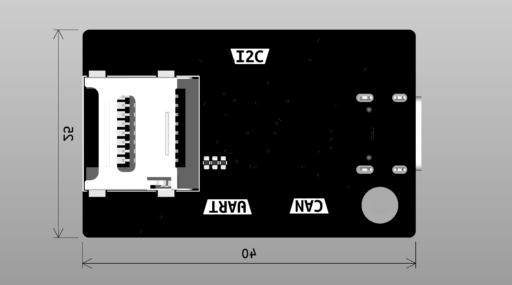
</p>

<p align="center">
  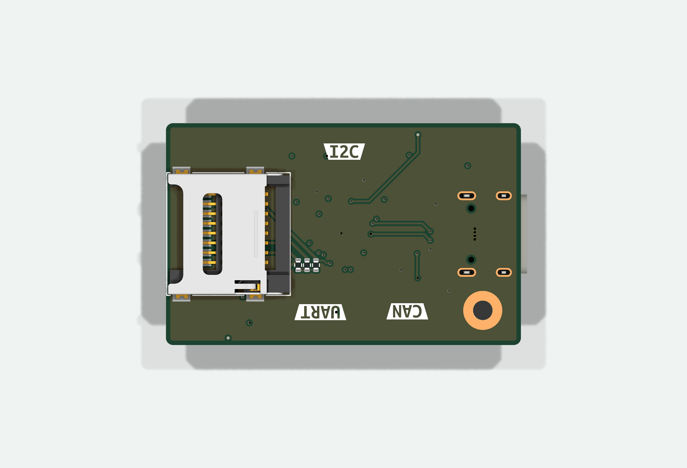
</p>

The board outline dimensions shown in the PCB drawing are **40 x 25 mm**. This is a design dimension, not an enclosure or mechanical qualification. The KiCad stackup defines four copper layers.

## Hardware Architecture

<p align="center">
  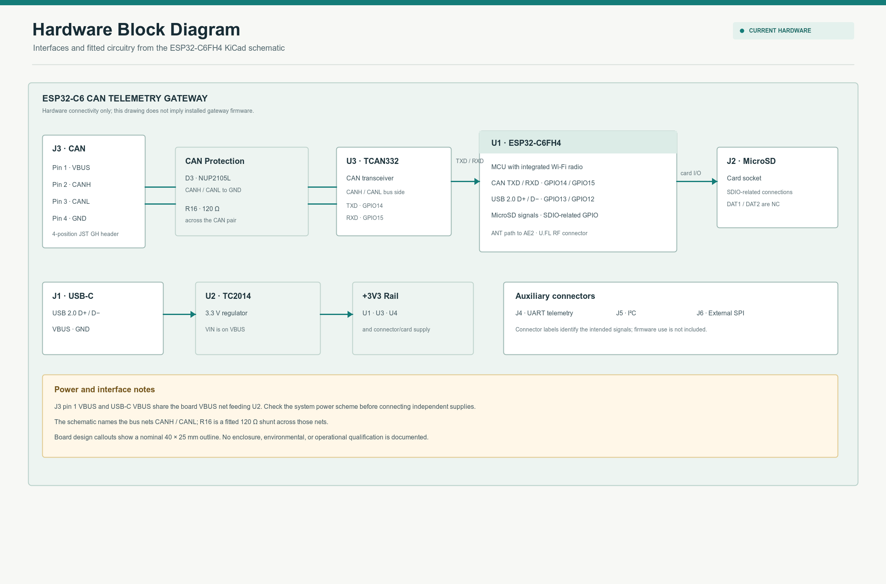
</p>

Major circuit references:

| Function | Design reference | Schematic value / note |
|---|---|---|
| MCU | U1 | ESP32-C6FH4 |
| CAN transceiver | U3 | TCAN332, supplied from +3V3 |
| CAN protection | D3 | NUP2105L, connected to CANH, CANL, and GND |
| CAN shunt | R16 | 120 ohm across CANH and CANL |
| 3.3 V regulator | U2 | TC2014-3.3VxCTTR |
| MicroSD socket | J2 | DAT1 and DAT2 pins are marked no-connect |
| USB connector | J1 | USB 2.0 Type-C receptacle |
| RF connector | AE2 | KH5220-A36 U.FL footprint/model |
| USB VBUS protection | D2 | SZESD9B5.0ST5G |

The schematic also contains J4 UART telemetry, J5 I2C, and J6 External SPI connector blocks. Their presence does not indicate that any corresponding firmware interface is implemented.

## CAN Interface

<p align="center">
  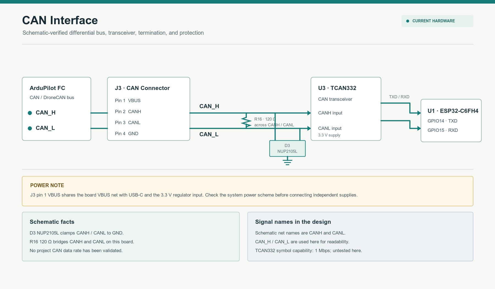
</p>

J3 pinout from the schematic:

| J3 pin | Net / function |
|---:|---|
| 1 | VBUS |
| 2 | CANH |
| 3 | CANL |
| 4 | GND |

The schematic net names are `CANH` and `CANL`; the diagrams also use `CAN_H` and `CAN_L` for readability. R16 is drawn as a 120 ohm shunt across the pair. Check whether this fixed termination is appropriate for the board's position on the intended bus.

**Power caution:** J3 pin 1 is on the same VBUS net as the USB-C VBUS input and the input to U2. Review the complete system power arrangement before connecting independent supplies to USB-C and J3.

The TCAN332 symbol metadata describes a 1 Mbps-capable transceiver. The repository does not state or verify a project operating bit rate; no measured CAN performance is claimed.

## Wi-Fi and Internet Telemetry

The ESP32-C6FH4 includes a Wi-Fi radio, and the schematic routes its antenna connection through a matching network to AE2. This establishes the board-level RF path, not a validated antenna, range, regulatory result, or working network stack.

The intended uplink is:

```text
ArduPilot CAN / DroneCAN -> ESP32-C6 -> Wi-Fi -> Internet -> telemetry backend
```

Driver, DroneCAN parsing, data transport, cloud API, database, and dashboard software remain planned.

## MicroSD and Local Logging

J2 is a fitted MicroSD socket connected to SDIO-related MCU pins. DAT1 and DAT2 are explicitly marked no-connect in the schematic. The socket provides a hardware location for removable storage; card initialization, file format, flight logging, and recovery behavior are not implemented here.

## Telemetry Data Pipeline

<p align="center">
  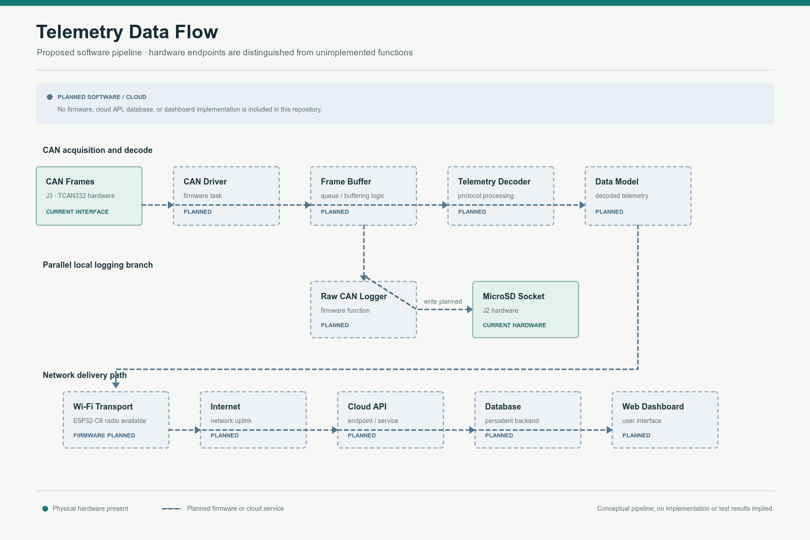
</p>

The dashed blocks are planned firmware or cloud functions. No store-and-forward behavior is implemented or verified in this repository.

## ArduPilot / DroneCAN Integration

J3 is the board's CAN connector and is labeled `CAN` in the schematic. Before connecting it to a flight controller, verify connector wiring and polarity, bus termination, shared VBUS behavior, and the firmware's eventual protocol support. This repository does not include an ArduPilot integration guide, firmware, or a verified DroneCAN node implementation.

## Hardware Specifications

| Parameter | Design information |
|---|---|
| MCU | ESP32-C6FH4 |
| Wireless | ESP32-C6 integrated Wi-Fi radio; RF path to U.FL connector |
| CAN transceiver | TCAN332, 3.3 V supply in the schematic |
| CAN protection | NUP2105L |
| CAN shunt | 120 ohm, R16 across CANH / CANL |
| Local storage | MicroSD socket; DAT1 / DAT2 no-connect |
| USB | USB-C receptacle, USB 2.0 D+ / D- |
| Logic / peripheral rail | +3V3 net |
| Regulator | TC2014-3.3VxCTTR |
| CAN connector | 4-position JST GH footprint, J3 |
| PCB outline | 40 x 25 mm per board drawing |
| PCB stackup | Four copper layers per KiCad project |
| CAN rate | Not specified or tested by this project. The TCAN332 symbol metadata lists 1 Mbps capability only. |

Values above are taken from the schematic, PCB, and project stackup. They are not production tolerances, measured performance, environmental ratings, or system qualification results.

## Repository Structure

```text
.
|-- ESP32-C6FH4.kicad_pcb
|-- ESP32-C6FH4.kicad_pro
|-- ESP32-C6FH4.kicad_sch
|-- Connectors.kicad_sch
|-- lib/
|   |-- footprints.pretty/
|   |-- packages3d/
|   `-- symbol/
`-- docs/
    |-- 3d/ESP32-C6-CAN.step
    |-- diagrams/
    `-- images/
```

The KiCad project names are preserved. Custom ESP32-C6 footprint and symbol assets are under `lib/`.

## 3D CAD Model

[Download the board assembly STEP model](docs/3d/ESP32-C6-CAN.step). It was exported from the supplied KiCad PCB and available 3D models. Component coverage depends on the 3D models present in the design; the STEP file is a design visualization, not a mechanical tolerance model.

Editable diagrams are in [`docs/diagrams/`](docs/diagrams/): [system architecture](docs/diagrams/system-architecture.svg), [CAN interface](docs/diagrams/can-interface.svg), [hardware block diagram](docs/diagrams/hardware-block-diagram.svg), and [telemetry data flow](docs/diagrams/telemetry-data-flow.svg).

## Releases and Packages

There are no published versioned releases or GitHub Packages for this project yet. Use the [GitHub Releases page](https://github.com/vish-official-2525/ESP32C6-CAN/releases) to check for future tagged hardware snapshots.

For this hardware project, a release archive is the appropriate distribution format for versioned KiCad sources and manufacturing exports such as Gerbers, drill files, BOM, and STEP. Those manufacturing bundles are not published yet. The current STEP model and KiCad sources remain available in this repository; there is no installable software package or firmware binary.

The current PCB DRC and schematic-parity findings are recorded below. A tagged fabrication release should wait until those findings are reviewed and the design has an explicit validation status.

## Schematic Overview

<p align="center">
  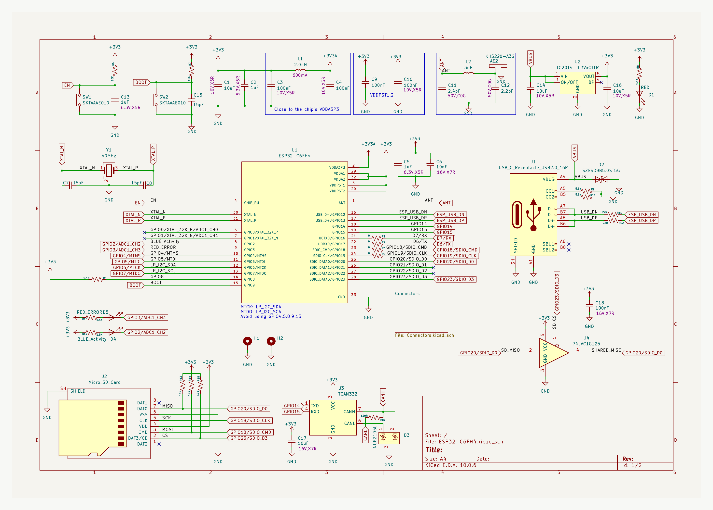
</p>

The schematic sheets are `ESP32-C6FH4.kicad_sch` and `Connectors.kicad_sch`.

<p align="center">
  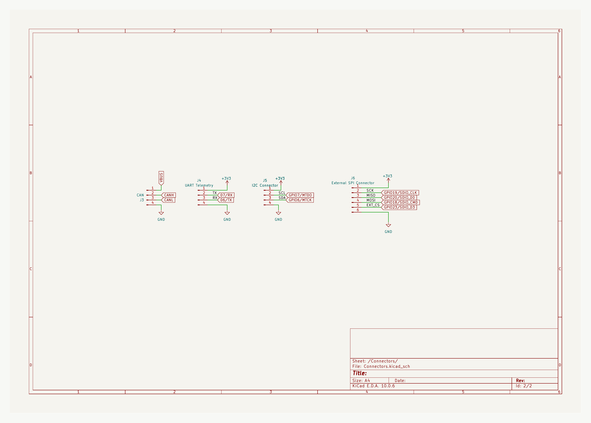
</p>

## Project Status

| Area | Status |
|---|---|
| KiCad schematic and PCB | Present |
| Custom symbol, footprint, and 3D assets | Present |
| PCB render and STEP export | Present |
| ESP32-C6 gateway firmware | Not included |
| CAN / DroneCAN protocol processing | Not included |
| MicroSD flight logging | Not included |
| Wi-Fi telemetry transport | Not included |
| Cloud API, database, dashboard | Not included |
| Bench, RF, environmental, or flight validation | Not reported |

## Development Roadmap

- Implement and document the CAN driver and supported ArduPilot / DroneCAN messages.
- Define telemetry buffering and failure handling.
- Implement MicroSD initialization, logging format, and recovery behavior.
- Add Wi-Fi transport and document its security and reconnection behavior.
- Define a cloud protocol and backend only when an implementation exists.
- Resolve the recorded PCB DRC and schematic-parity findings, then document electrical and system validation.

## Reliability Considerations

A read-only KiCad PCB DRC run with schematic parity reported **154 violations**: 52 via-diameter, 52 annular-width, 38 copper-clearance, 4 hole-clearance, 3 hole-to-hole, 2 silkscreen-edge, 2 copper-edge-clearance, and 1 missing H2 footprint. Separately, the report lists local-override warnings for the J6 symbol/footprint value mismatch and J1 library-footprint mismatch. It also reported **2 schematic-parity issues** and **0 unconnected pads**. This is not a clean DRC result, and it should be reviewed before fabrication; no fixes were made as part of this documentation work.

No CAN bitrate, USB/SD behavior, Wi-Fi range, power/current rating, connector rating, operating temperature, EMI/ESD immunity, or flight safety claim has been validated by this repository. Perform design review and bench testing before connecting the board to flight-critical equipment.

## License

No `LICENSE` file is currently present. Until a license is added, reuse and redistribution permissions are not specified; do not assume the hardware files are licensed for a particular use.

## Author

Repository owner: [vish-official-2525](https://github.com/vish-official-2525).
